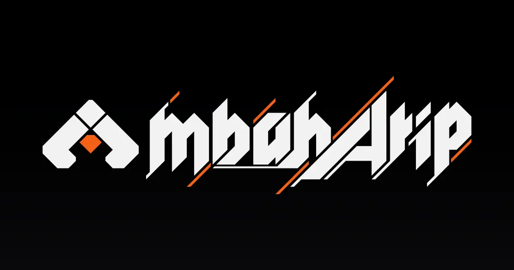

# mbaharip Portfolio

Hello! I'm **Arief Rachmawan**, a **Developer** from **Bandung, Indonesia**. I'm currently a student at **Sekolah Tinggi Teknologi Bandung** pursuing a Bachelor's degree in Computer Science.

## Description

This is my portfolio website. I made this website to showcase my projects and skills.  
This website is made using [Next.js](https://nextjs.org/) and [Tailwind CSS](https://tailwindcss.com/), and I'm using [Obsidian](https://obsidian.md/) to manage my blog posts.

> Read how i use Obsidian as CMS for my website [here](https://www.mbaharip.com/blogs/TODO).

## Development

### Prerequisites

- [Node.js](https://nodejs.org/en/) (v16 or newer)
- [Yarn](https://yarnpkg.com/) (v1 or newer)

### Installation

1. Clone this repository: `git clone git@github.com:mbahArip/mbaharip-portfolio.git`
2. Install dependencies: `yarn install`
3. Run the development server: `yarn dev`
4. Open [http://localhost:3000](http://localhost:3000) with your browser to see the result.

## Contact

- Email: [me@mbaharip](mailto:me@mbaharip.com)
- LinkedIn: [mbahArip](https://www.linkedin.com/in/mbaharip/)
- Twitter: [mbahArip](https://twitter.com/mbahArip_)
- Discord: @mbaharip
